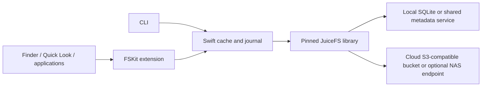

# ParaAir

Last updated: 2026-10-09

A development implementation of a CLI-first streaming drive for macOS 26+, with cloud object storage as the primary deployment and self-hosted NAS storage as an optional backend. A Swift FSKit extension presents the filesystem to Finder. A pinned JuiceFS engine supplies managed metadata and object storage. Reads fetch touched blocks, writes first enter a durable local journal, and explicit pinning downloads offline content.

**ParaAir now opens in Finder and appears in Favorites and Locations at `/Volumes/ParaAir` on this Mac.** The October 9 fix supplies the mandatory FSKit flags/access-time attributes; native mounting, bookmark resolution, directory listing and a real sidebar click pass with the existing R2 connection. The native API is the default on macOS 27+ with its entitlement; macOS 26 retains the helper route. Local tests, the bounded R2 backend test and earlier mounted range reads pass. This is a development alpha; other cloud/NAS backends, media applications and a notarized clean-Mac installation remain unvalidated. Remaining release gates are listed under [Acceptance matrix and remaining gates](#acceptance-matrix-and-remaining-gates).

ParaAir Cloud, a hosted subscription that removes provider accounts and bucket setup, is planned but not implemented. [`pricing/`](pricing/) holds the reproducible cost model used to compare storage providers. The early-access page in [`site/`](site/) is published at [paraair.pages.dev](https://paraair.pages.dev/).

ParaAir is licensed under the [Apache License 2.0](LICENSE); see [NOTICE](NOTICE).

The canonical project directory, Swift package and generated Xcode project are named **ParaAir**. The old workspace path `streamdrive` is a compatibility symlink so existing development metadata, library paths and app registration continue to resolve. Bundle IDs, shared Keychain groups and storage formats retain their existing identities to preserve access. This directory is a standalone Git repository connected to the private [parafieldai/ParaAir](https://github.com/parafieldai/ParaAir) repository. The remote is created and configured; local source has not yet been committed or pushed.

## Build and local validation

Requirements: Apple Silicon Mac, macOS 26+ for the filesystem, Xcode with the macOS SDK, Swift, Go and XcodeGen. The native script pins and verifies JuiceFS source and privately obtains its required Go toolchain. No package, driver, app or filesystem extension is installed by these scripts. Builds require 100 GiB free under this workspace's disk policy.

```sh
cd /Users/user/Documents/Automation-agents/ParaAir
scripts/build-juicefs.sh --test
CLANG_MODULE_CACHE_PATH="$PWD/.build/module-cache" \
SWIFTPM_MODULECACHE_OVERRIDE="$PWD/.build/module-cache" \
STREAMDRIVE_NATIVE_LIBRARY="$PWD/native/lib/libstreamdrive.dylib" \
swift test --cache-path .build/pm-cache --disable-sandbox
scripts/build-app.sh
```

The app is `.build/xcode/Build/Products/Release/ParaAir.app`, with its CLI helper at `Contents/Helpers/paraair`. The standalone CLI path is printed by `swift build --show-bin-path`; this Xcode-backed Swift toolchain uses `.build/out/Products/Debug/paraair`. `scripts/acceptance.sh` exercises the built CLI on a disposable local-directory fixture. Swift native tests additionally exercise the **real JuiceFS library with SQLite metadata and local object storage**, not just that fixture adapter. Code modules, environment variables, native-library names and the existing `StreamDrive` state directory retain their compatibility identities.

## App setup and Finder

The product uses Glide, confirmed by the user on October 9: an abstract flight mark made only from polygons in charcoal, warm white and muted green, with a matching monochrome menu-bar mark. [Artwork, build pipeline and previous provenance](macOS/Resources/Branding.md).

**Drive appearance…** changes the visible Finder name and chooses a local custom PNG/JPEG/HEIC/TIFF image, or restores the default polygon product icon. Names with spaces and Unicode are supported; the stable profile/storage identity is retained. The new name appears in the sidebar immediately and becomes the volume name on the next mount. The signed build's name change was verified in Finder and restored to ParaAir. The default/custom icon is visible in ParaAir, but Finder currently keeps its generic document sidebar icon on this mount; supplying an IconRef through the deprecated Favorites API did not change it. Custom image files are resized to 256 pixels and saved in local state, with no icon upload to the bucket.

Open ParaAir, enable its file system extension in **System Settings → General → Login Items & Extensions → By Category → File System Extensions**, then connect storage and choose **Create drive**. The app includes the mount helper and attempts to mount the new drive. **Mount when ParaAir opens**, enabled by default, controls mounting the saved drive on later app launches. macOS requires the extension approval; creating a connection does not bypass it.

After a verified mount, ParaAir attempts to add the drive to Finder’s Favorites using a public, deprecated Apple API. Successful registration is recorded once so removing the favorite is honored on later launches. **Add to Sidebar** explicitly retries registration. The native route defaults on macOS 27+ with its provisioned entitlement; the CLI helper remains the fallback. October 9 runtime validation confirmed automatic Favorites registration, the native Locations entry and opening the real volume from its favorite. The two obsolete test shortcuts were removed. Preview and clean-Mac installation validation are still required. See [the macOS guide](macOS/README.md).

Run the bounded 32 MiB local benchmark separately:

```sh
CLANG_MODULE_CACHE_PATH="$PWD/.build/module-cache" \
SWIFTPM_MODULECACHE_OVERRIDE="$PWD/.build/module-cache" \
STREAMDRIVE_NATIVE_LIBRARY="$PWD/native/lib/libstreamdrive.dylib" \
STREAMDRIVE_BENCHMARK_OUTPUT="$PWD/.runtime/local-benchmark.json" \
swift test --cache-path .build/pm-cache --disable-sandbox --filter NativeBenchmarkTests
```

It compares first range, distant seek, warmed cache, sequential reads and a local file. It records object GET payload bytes independently of requested application bytes. Fresh client cache does **not** mean a cold host SSD. These timings do not predict video startup over a WAN.

One local debug-build run on October 2, 2026 (macOS 27.2, 12 CPU cores) produced:

| Operation on the 32 MiB nonsparse file | Time | Object payload fetched |
|---|---:|---:|
| Metadata listing | 1.02 ms | 0 |
| First 64 KiB read | 13.65 ms | 1 MiB |
| Distant 64 KiB seek | 13.07 ms | 1 MiB |
| Repeated 64 KiB read | 0.86 ms | 0 |
| Sequential 32 MiB, partly warm | 420.59 ms | 30 MiB |
| Direct local-file 64 KiB read | 0.016 ms | 0 remote bytes |

These are single-run diagnostic observations, not latency percentiles or a comparison to an uncached physical SSD. Raw counters and conditions are in `.runtime/local-benchmark.json`. They demonstrate partial fetching and expose substantial adapter/cache overhead to optimize; they do not establish internal-SSD-equivalent speed.

The home window and menu bar panel are pure views of a `HomePresentation` value built from app state ([HomePresentation.swift](macOS/App/HomePresentation.swift), [HomeViews.swift](macOS/App/HomeViews.swift)): a four-step setup checklist, one primary action per state, and notices for sign-in or mount problems. `scripts/render-ui-snapshots.sh` checks that state logic and renders the home window, menu panel and Storage Settings offscreen in light and dark mode. It needs an earlier `scripts/build-app.sh` for the core object file and never launches, signs or mounts the app:

```sh
bash scripts/render-ui-snapshots.sh .runtime/ui-snapshots
```

## CLI workflow

`connect` saves a non-secret profile for an **existing, formatted JuiceFS volume**. It never formats or imports a user's storage. Examples use placeholders:

```sh
# This SQLite database must already describe a formatted cloud-backed volume.
# Keep it inside the state directory for the extension's scoped access.
export STREAMDRIVE_HOME=/absolute/path/to/state
paraair connect cloud --metadata-url sqlite3:///absolute/path/to/state/metadata/cloud.db \
  --library /absolute/path/to/libstreamdrive.dylib \
  --mount-point /absolute/path/to/empty-mountpoint
paraair doctor cloud
paraair ls cloud /media
paraair status cloud --json
paraair mount cloud
paraair reveal cloud /media
paraair pin cloud /media/project
paraair uploads cloud --json
paraair uploads cloud --retry
paraair cache cloud --evict
paraair unpin cloud /media/project
paraair unmount cloud
```

Global `--state-dir PATH` or `STREAMDRIVE_HOME` selects state; the default is `~/Library/Application Support/StreamDrive`. `connect --fixture-root PATH` explicitly selects the test-only local-directory adapter. It is not a production NAS or object-storage substitute. `connect --replace` only makes deliberate configuration changes; state must never be repointed at another backend while old journals/cache exist.

Credential-bearing URLs are rejected in public profiles and command arguments. Use `--credential-id NAME` and the app's secure credential-entry UI to store the authenticated metadata URI in Keychain. The URI must address the configured volume. Shared Keychain access is verified in the Developer ID signed app and packaged CLI; the sandboxed extension still needs runtime validation. The separate Connections window stores OAuth tokens and S3 keys in Keychain. `paraair connections --json` lists nonsecret references; `connect --connection ID --metadata-url URI` attaches a saved connection to an existing formatted volume. It does not start sign-in or accept storage secrets.

Mounting requires an installed, signed and enabled FSKit extension. See [the macOS build and activation guide](macOS/README.md). The mount resource is the state directory, granting scoped access to its cache and journal. A development library or local fixture outside that directory is unsuitable for the sandboxed extension; the packaged native library is embedded in the app.

## Storage, cache and write semantics



- JuiceFS owns the remote managed layout. Import ordinary files through a mounted volume; do not put them directly into JuiceFS's object prefix.
- The default read cache budget is **1 GiB**, block size **1 MiB**, journal ceiling **4 GiB**, and free-space reserve **5 GiB**. Native memory buffers are bounded separately. Read cache, pinned blocks and pending writes have separate accounting. Pins can exceed the evictable-cache budget but respect free-space reserve. Interrupted pins remain visibly incomplete.
- Directory listing reads metadata only. Reads fetch individual blocks and use a one-second metadata cache; native prefetch and sequential readahead are disabled for the first measurable baseline. JuiceFS's object block boundaries can amplify a small read. There is no automatic whole-file warmup.
- A successful write means its immutable local payload and SQLite journal are persisted. SQLite FULL synchronization and macOS full-sync requests are used. Explicit `fsync`/filesystem synchronization means remote publication completed, or returns an error. A mounted uploader retries pending files in the background.
- Publication seals a transaction, clones the remote base without downloading the whole file, applies changed extents, fsyncs, and atomically renames the stage. A transaction marker recognizes retries after a lost reply. A subsequent edit of the same file waits for that sealed transaction to resolve. Independent publication uses a separate connection and does not hold the local state lock throughout upload.
- Cache eviction never deletes pending writes. A journal limit or low free-space condition rejects a new write before acknowledgment. Shrink/extend operations zero the newly exposed region; deleted data is not resurrected.
- Cooperative clients take a distributed mutation lock and compare file versions. A stale edit becomes a retained conflict instead of silently overwriting the winner. The `uploads` command reports it. Automatic merge, force-overwrite and conflict-resolution UI are not implemented; keep the state directory intact. A partial conflicted file may need its old remote version to reconstruct untouched regions. Ordinary external JuiceFS writers must be quiesced because they do not acquire this adapter's mutation lock.
- Completed pins describe an offline snapshot. Observed remote changes invalidate completion; re-pin to refresh. Offline operation uses previously cached metadata and blocks. Uncached data and new namespace operations require connectivity.
- `status --json` reports allocated cache/pin/journal/state bytes separately from logical sizes. `objectReadBytes` and `objectGetRequests` count observed object payload transfers through this client, excluding metadata traffic and protocol overhead; a crash mid-request may undercount. Finder's allocated-size field cannot by itself prove total SSD usage.

The initial implementation intentionally serializes metadata/cache work and each pin operation. Large directory scans or pins can delay other commands. Repeated edits of one file can accumulate journal extents until upload, reaching the configured bound. Parallel prefetch, journal compaction and directory-index scaling need workload measurements before adding complexity.

## Cloud storage and optional NAS deployment

Cloud storage is the primary acceptance path. Validate **Cloudflare R2 Standard first** as the candidate default for frequent streaming: its [pricing](https://developers.cloudflare.com/r2/pricing/) includes free internet egress, with storage and request charges. Keep [Backblaze B2](https://www.backblaze.com/cloud-storage/pricing) as a lower storage-cost alternative with an included egress allowance, and [Amazon S3 Standard](https://aws.amazon.com/s3/pricing/) as a regional compatibility reference. Use their S3 APIs and ordinary online storage rather than a tier requiring an archive restore. The existing R2 connection has the bounded validation described below; the other providers remain interoperability targets. Measure first reads, distant seeks, previews, uploads and recovery on an actual cloud bucket before recommending a provider on speed. NAS availability must not block this work.

The pinned JuiceFS documentation contains an older warning about R2's unordered object listings. Its source already disables the sorted-list requirement for `gc`, `fsck` and `destroy`; the [v1.4.0 release notes](https://github.com/juicedata/juicefs/releases/tag/v1.4.0) describe the unordered-listing fix for maintenance operations. Do not treat the old warning as a demonstrated current blocker. Remote compatibility and backup/restoration still require validation.

This client connects to an existing JuiceFS **metadata URL**; it does not take an S3 bucket URL as its filesystem root. For the first single-Mac cloud test, use local SQLite metadata inside the ParaAir state directory with cloud object storage. This needs no NAS or separate metadata server. The database is authoritative filesystem metadata, not an evictable cache: back it up and test restoration alongside the referenced cloud objects. For multiple Macs sharing a volume, use a supported shared metadata service such as PostgreSQL or Redis. See [JuiceFS metadata options](https://juicefs.com/docs/community/databases_for_metadata/).

## Separate storage connection manager

R2 Standard's published monthly free allowance, checked October 2, 2026, is 10 GB-month of storage, one million Class A requests and ten million Class B requests. Direct R2 download bandwidth is free; the request allowance still applies. Infrequent Access does not receive these free allowances. [Cloudflare pricing](https://developers.cloudflare.com/r2/pricing/). The live smoke test uses only generated data and enforces cumulative limits of 64 MiB uploaded payload, 128 MiB downloaded payload and 200 object requests across its native handles. These are test-run limits, not an account-wide billing cap. The initial account dashboard showed 0 B stored, zero Class A/B operations and no billable usage.

Open **Connections…** in the menu bar app. Authorization and secure key entry happen there; the CLI consumes a saved connection ID. The app renews expiring credentials every 30 seconds while running. Active storage backends detect replacement credentials between operations, verify the same metadata volume identity, and keep cumulative transfer counters. Offline failures preserve credentials and pending writes. Disconnect blocks future remote operations; reconnect must match the same provider, account, bucket and region.

| Provider | Implemented connection method | Prerequisite / verification limit |
|---|---|---|
| Cloudflare R2 | External-browser Authorization Code + PKCE, account/bucket selection, Keychain refresh | Live sign-in, shared Keychain access, bounded 32 MiB fixture test, mounted range integrity, Finder listing and sidebar navigation verified |
| Amazon S3 | AWS IAM Identity Center device browser sign-in, explicit account and role, renewable role credentials | Organization SSO start URL/region and S3-enabled role; ordinary consumer AWS login is not an Identity Center setup |
| Backblaze B2 | Native secure S3 key entry, regional endpoint validation, signed bucket HEAD | Existing bucket and application key with suitable read/write permissions; HEAD checks access, not write authorization |
| Custom S3 / NAS | Native secure S3 key entry, explicit HTTPS origin, bucket and signing region | Trusted TLS endpoint; supports private/Tailscale hosts; no automatic TLS bypass or claimed vendor-wide compatibility |

After verifying a connection, **Create drive** explicitly initializes a fresh local SQLite metadata database and a random managed object prefix, then attempts mounting and sidebar registration. Existing bucket objects are not imported or deleted, and there is no automatic bucket creation. The R2 form also offers **Create Standard bucket**, which requires an explicit confirmation naming the account, bucket and provider charges. R2 activation/billing setup still happens in Cloudflare. The database plus cloud objects are both required for recovery. Use a separate state directory for each Finder drive; the native unary FSKit container supports one profile per mount resource. Standard CLI-only profiles can still be stored together when not mounted.

### Cloudflare developer registration

A real client ID is required before a working OAuth link can be generated. A dashboard login link does not connect the app. The development registration fields are:

- Client name: `StreamDrive Development`; private visibility for same-account testing.
- Response type: `code`; grant types: `authorization_code` and `refresh_token`.
- Token endpoint authentication: `none`; PKCE: `S256`.
- Exact callback: `http://127.0.0.1:49731/oauth/callback`.
- Required permission scopes: `account-settings.read`, `workers-r2.write`; the authorization request also requests `offline_access` for renewal.

Register using [Cloudflare's OAuth client page](https://dash.cloudflare.com/?to=%2F%3Aaccount%2Foauth-clients), following its [public PKCE client documentation](https://developers.cloudflare.com/fundamentals/oauth/create-an-oauth-client/). Enter the resulting **public client ID** in Connections → Development OAuth registration. There is no client secret. Public distribution additionally needs Cloudflare client-domain verification; end users should receive the registered client ID bundled in a release, rather than register their own app. The development build reads a nonsecret state-directory override. Set `STREAMDRIVE_CLOUDFLARE_CLIENT_ID` when running `scripts/build-app.sh` to bundle the registered public client ID for every user of the release; no developer registration entry is then needed on their Macs.

The live OAuth scope inventory on October 2, 2026 included R2 access but no Account API Tokens Write scope. This implementation therefore does not claim to mint bucket-scoped S3 keys from OAuth. R2 uses the [authenticated REST object API](https://developers.cloudflare.com/api/resources/r2/subresources/buckets/subresources/objects/methods/get/). The OAuth grant is account-wide R2 permission; application-level bucket binding is not a server-enforced bucket-only grant.

The R2 adapter fetches a complete bounded JuiceFS chunk (normally up to 4 MiB, hard ceiling 8 MiB), then serves the requested range. It does not download a full large file and does not claim undocumented server-side Range or HEAD behavior. Metrics count all object bytes fetched, including this amplification. REST API rate limits and sustained/concurrent WAN performance need further measurement. This new `cloudflare-oauth` format requires ParaAir's bridge; stock JuiceFS maintenance commands do not know this driver, and its object listing/copy/multipart maintenance operations are not implemented. Back up the bucket and metadata using provider-aware procedures.

Live validation on October 2, 2026 completed registration, consent, PKCE token exchange, account/bucket discovery and Keychain persistence. After explicit approval, the private Standard bucket `streamdrive-test-20261002` was created. The standalone test helper successfully used the saved connection through Keychain without exporting credentials. Its 32 MiB synthetic file passed partial reads, distant seeking, a cached read and full SHA-256 verification. The run uploaded 33,554,432 bytes and downloaded 41,945,472 response-body bytes (40 MiB of file chunks plus 2,432 bytes of API replies), with 18 object requests: eight PUTs and ten GETs. Conservative download reservations totaled 84,410,386 bytes, below the 128 MiB cap. No remote deletion was performed. The dashboard still reported $0 billable usage immediately afterward, while its operation/storage counters had not yet caught up with the test.

| Live R2 check | Observed result |
|---|---|
| Upload 32 MiB and wait for remote acknowledgment | 1.768 s |
| Metadata directory listing | 1.36 ms; zero object requests/bytes |
| First 64 KiB read | 522 ms; one 4 MiB object fetched |
| Distant 64 KiB seek near the end | 399 ms; one more 4 MiB object fetched, still only 8 MiB fetched from a 32 MiB file |
| Repeat first range from ParaAir cache | 1.43 ms; zero additional object requests/bytes |
| Full integrity read | 4.011 s; eight additional GETs; SHA-256 matched |

This is one run, not a playback or Finder benchmark. The strict test transport uses fresh HTTP/1.1 connections without keepalive/replays; provider caches are uncontrolled. The ordinary client retains connection reuse. Limits apply to this test process, not all account activity. The report is [report.json](.runtime/connected-smoke-e65d88f9-a9c2-4bdf-b2a6-013143621d84/report.json); its directory retains local SQLite metadata, the generated payload and a 2 MiB read cache. The bucket retains 32 MiB of test chunks, safely below the initially unused free storage allowance. Nothing repeats automatically.

Build the runner with `scripts/build-connected-smoke.sh`; invoking the resulting `connected-smoke` without `--run` is a no-network dry run. Live mode requires an explicit saved connection ID, fixes the 32 MiB file and 64/128 MiB plus 200-request caps, and has a 300-second watchdog. It refuses an older native library without pre-dispatch reservation metrics. Each new process is a new test budget: review account headroom and previous runs before deliberately repeating it.

The app opens the default external browser and also displays a read-only **Browser sign-in link** with a Copy link button while authorization is pending. Disable **Open default browser automatically** before sign-in to open the link only in a chosen browser profile. Use that original authorization link in the profile signed into the desired account. A redirected Cloudflare login-challenge URL is tied to its originating browser session and must not be transferred between profiles. The original link clears on completion, cancellation or failure and is not logged or saved. Failed bucket discovery is distinguished from a successfully loaded empty list; HTTP 403 suggests checking R2 activation and account permissions without discarding the completed sign-in. All 16 focused provider tests passed after this live-discovered onboarding correction.

For the optional NAS backend, place a supported metadata service and a JuiceFS-compatible S3 endpoint near the disks. Reach both through Tailscale DNS/IP and keep credentials outside CLI history. Avoid relayed Tailscale paths for throughput testing and record direct/relay status, round-trip latency, uplink speed, object service and disk configuration. An ordinary SMB share is not the backend used by this adapter.

The current native build includes `file`, S3 and bounded `cloudflare-oauth` object adapters and uses supported metadata drivers from the pinned JuiceFS release. It rejects unsupported sharded, nondefault/multiple-tier, RSA-encrypted or Kerberos configurations. An S3-compatible endpoint is a compatibility target, not a guarantee that every vendor's semantics work. See [native engine details and backup tests](native/README.md).

For a coherent backup, quiesce writers and capture both metadata and its referenced objects. Object-only backup cannot reconstruct names and filesystem metadata. Local tests cover metadata dump plus object-copy restoration into fresh metadata; production backup procedures must be tested against the actual provider and its versioning/retention settings.

## Acceptance matrix and remaining gates

| Area | Local evidence | Remaining validation |
|---|---|---|
| Streaming | Sparse and nonsparse range/seek tests with object counters | Large-video playback and distant seeking through signed FSKit |
| Finder | Enabled FSKit mount, byte-exact range reads, working bookmark/listing and sidebar navigation; unknown capacity displays `-- available` | Actual Finder copy, previews, media applications and clean-Mac installation |
| Quick Look | Read-range implementation and benchmark harness | JPEG, PDF and video previews with before/after object-byte counters |
| Cache/offline | Eviction, pin retention, version refresh, offline cached reads, allocated-byte tests | Real disk-pressure soak and large folder performance |
| Writes/recovery | Journal reopen, lost-ack replay, failed stage, conflicts, shrink/extend and multiple clients | Forced process/power interruption during live mounted app workflows |
| Remote storage | Local objects plus live R2 Standard 32 MiB upload/range/cache/integrity pass | Larger R2/app workflows, B2, AWS S3 Standard; optional NAS + Tailscale later |
| Packaging | Actual FSKit extension and app build; ad-hoc signature verification | Developer signing/provisioning, Keychain access, activation and distribution |

Validation on October 2, 2026: the full connection suite had **119 Swift tests pass, one optional benchmark skipped, zero failures** (120 total); the subsequent focused provider suite passed all 16 tests. All **32 native Go tests** and **four Python harness checks** pass; CLI acceptance and direct FSKit callbacks pass. The live runner also passed its dry-run/six argument checks and the R2 test above. The release host/extension built and the nested ad-hoc signature verified. Native budget tests cover retries, concurrent dispatch/read bounds and counters surviving reopened handles. Provider regression tests use mock transports; native credential-rotation tests use local SQLite. Logs are in `.runtime/swift-final-connections-tests.log`, `.runtime/build-app-connections.log` and `.runtime/build-app-r2-budget.log`. Independent review findings about replacement identities, rename semantics, backend identity binding, pin version cleanup, upload lock scope and pre-dispatch download reservations were corrected. Native initialization cleanup and release-linked ASCII profile-name validation also have regression coverage.

Hard links, symlinks, xattrs/resource forks, ownership changes and chmod are not implemented. Do not use this build for Photos libraries, databases, Git working copies, Time Machine or other workloads requiring full APFS/POSIX semantics without dedicated compatibility work.

Stage 1's standard JuiceFS mount and rclone comparison requires those tools/mounts to be supplied. Use the same test file on already mounted paths:

```sh
python3 scripts/compare-mounts.py \
  --candidate paraair=/path/to/paraair/video.mp4 \
  --candidate juicefs=/path/to/juicefs/video.mp4 \
  --candidate rclone=/path/to/rclone/video.mp4
```

Add `--quick-look` for native thumbnail generation; optional `--cli`, `--profile` and `--state-dir` capture ParaAir counters around operations. Evict only the disposable test client's read cache before the first run, keep pins out of that sample, and measure warm reads separately. The harness does not install, mount, flush system caches or alter supplied files. No Helumi-equivalent startup-speed claim is made.

Generated native caches, Swift/Xcode artifacts and local reports stay under ignored `.build-native`, `.build`, `native/lib` and `.runtime`. No simulator, Docker image, user credential or remote test volume is created by local validation.

Retained build directories: approximately 1.9 GiB in `.build-native` and 1.4 GiB in `.build`, plus the native library and existing generated 32 MiB fixture, metadata and read cache. Temporary callback/icon-compilation fixtures were removed; no simulator, container or result bundle was created by the October 8 checks. Product PNG/ICNS/SVG assets add approximately 79 KiB under `macOS/Resources` with copies in the signed app; previous artwork and provenance remain in `.runtime/brand-history/20261008-ribbon/` (about 4 MiB) and `.runtime/brand-history/20261008-polygon-a/`; small candidate previews remain in `.runtime/icon-directions-20261008/`. Public Mounter-profile snapshots and small diagnostic logs/previews remain in ignored build/runtime directories. The signed app remains in the project build directory. Its enabled extension mounts the existing R2 drive natively at `/Volumes/ParaAir` with zero pending uploads; earlier mounted range reads and shared credentials pass. Finder's favorite still fails to resolve, and the app now prevents further broken insertion. See [macOS signing and credential status](macOS/README.md). No commit or push was made.
